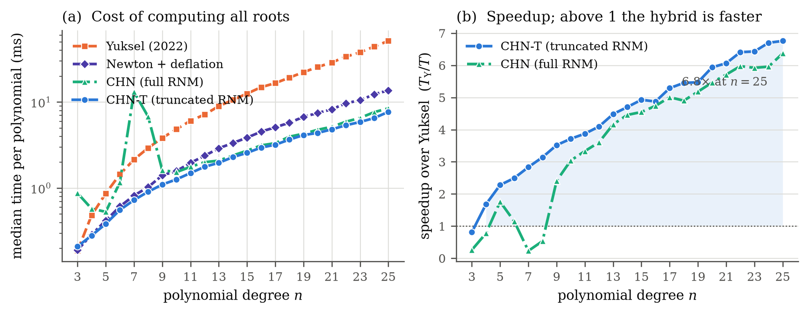
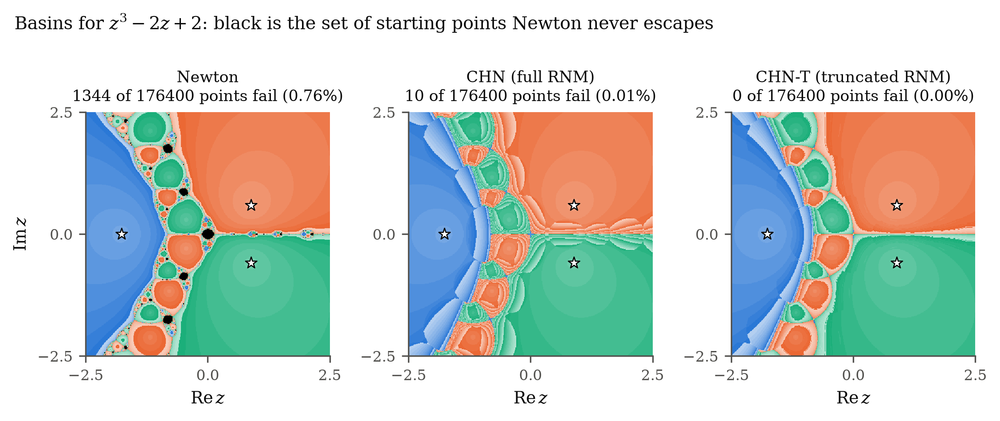

# A Conditional Hybrid Newton Method for Low-Degree Polynomials

Reference implementation and reproducible experiments for the conditional
hybrid of Newton's method with Kalantari's Robust Newton Method (RNM), compared
against Yuksel's 2022 interval-splitting solver.

Take the Newton step whenever it decreases `|p|`; otherwise take a robust step,
which decreases `|p|` by construction. The modulus is therefore strictly
decreasing along every orbit, so the iteration **cannot cycle** — unlike
Newton's method, which can.

## Results

On 100 random monic real-rooted polynomials per degree, roots drawn from
`U(-1, 1)` — the setting Yuksel's method is designed for:

| | degree 5 | degree 15 | degree 25 |
|---|---|---|---|
| CHN-T (this work) | 0.25 ms | 1.79 ms | 4.92 ms |
| Yuksel (2022) | 0.52 ms | 8.32 ms | 33.11 ms |
| **speedup** | **2.19×** | **4.69×** | **6.69×** |
| forward error | 1.1e-15 | 3.8e-12 | 1.5e-08 |

CHN-T is faster than Yuksel's method at every degree `n >= 4`, matches the
forward error of the LAPACK companion-matrix eigensolver, and returns all `n`
roots rather than the real ones alone — on polynomials with complex roots it
recovers 99.9% of them against Yuksel's 51.5%.



On `z^3 - 2z + 2`, where Newton has an attracting 2-cycle, Newton never reaches
a root from 0.76% of a 420×420 grid of starting points. The hybrid fails
nowhere.



## Quick start

```bash
git clone https://github.com/Shantanu115/chn-polyroot
cd chn-polyroot
pip install -r requirements.txt

python test_chn_solvers.py     # 11 correctness tests, ~2 min
python benchmark.py            # main sweep  -> data/benchmark.json
python experiments.py          # robustness  -> data/robustness.json, basins.npz
python figures.py              # all figures -> figures/*.pdf, *.png
```

Or open `CHN_polynomial_root_finding.ipynb`, which walks through the whole
study and reproduces every number and figure in the paper. It runs top to
bottom with no manual input; the full run takes about five minutes.

## Using the solver

```python
import chn_solvers as chn

coeffs = [1.0, 0.0, -2.0, 2.0]          # z^3 - 2z + 2, descending order
result = chn.solve_all_chn(coeffs, truncated=True)

print(result.roots)                      # all three roots, complex included
print(result.iterations, result.rnm_steps)
```

| Function | What it does |
|---|---|
| `solve_all_chn(coeffs, truncated=True)` | all `n` roots; the recommended entry point |
| `solve_chn(coeffs, z0)` | a single root from one starting point |
| `rnm_step(coeffs, z)` | the RNM increment, closed form |
| `truncated_rnm_step(...)` | adaptive truncated RNM: smallest `m` that descends |
| `solve_yuksel(coeffs, lo, hi)` | the baseline, real roots in an interval |
| `solve_newton_deflation(coeffs)` | ablation baseline: Newton, no robust fallback |
| `kalantari_bound(coeffs)` | the bound `U_2` on the modulus of the roots |

Coefficients are always in **descending** order, matching `numpy.roots`.

## What the method is

For `z` that is not a critical point, RNM is

$$\widehat{N}_p(z) = z - \frac{p(z)\,\overline{p'(z)}}{9\,A(z)^2},
\qquad A(z) = \max_{0 \le j \le n} \frac{|p^{(j)}(z)|}{j!}.$$

`p·conj(p')` is twice the Wirtinger derivative of `|p|²`, so the step follows
steepest descent of the modulus; the factor `1/(9A²)` is the step length for
which the Geometric Modulus Principle guarantees an a priori decrease. The map
is not rational, which is why its polynomiographs are smooth rather than
fractal.

The **truncated** variant replaces `A` by `A_m = max_{j<=m} |p^(j)(z)|/j!`.
Since `A_m <= A`, smaller `m` gives a longer step — aggressive, and no longer
guaranteed, but testable. The fallback searches upward from `m = 0` and stops
at the first `m` that decreases the modulus; `m = n` recovers the full
guaranteed step, so the search always terminates. In practice `m <= 2` suffices
in over 99.9% of fallback steps, and `A_0`, `A_1` reuse values Newton has
already computed.

## Repository layout

```
chn_solvers.py         the solvers; standard library only
benchmark.py           timing and accuracy sweep, degrees 3-25
experiments.py         robustness, stalling, basin rasters
figures.py             publication figures (PDF + 300 DPI PNG)
test_chn_solvers.py    correctness tests
build_notebook.py      regenerates the notebook from source
paper/main.tex         manuscript
paper/refs.bib         bibliography
data/                  benchmark output (JSON, NPZ)
figures/               generated figures
```

## Reproducibility

Every random draw derives from the master seed `20260828`, set in
`benchmark.py`. Timing is best-of-three wall clock per instance, reported as
the median over 100 instances; absolute times depend on the machine, ratios do
not.

## References

- B. Kalantari. *Polynomial Root-Finding and Polynomiography*. World Scientific, 2008.
- B. Kalantari. A geometric modulus principle for polynomials. *Amer. Math. Monthly* 118 (2011) 931–935.
- B. Kalantari. An infinite family of bounds on zeros of analytic functions and relationship to Smale's bound. *Math. Comp.* 74 (2005) 841–852.
- B. Kalantari. A globally convergent Newton method for polynomials. arXiv:2003.00372. Revised version forthcoming.
- B. Kalantari. Invitation to polynomiography via ChatGPT. *LASER Journal* 3(1), Art. 3, 2025.
- C. Yuksel. High-performance polynomial root finding for graphics. *Proc. ACM Comput. Graph. Interact. Tech.* 5(3), Art. 7, 2022.

## License

MIT.
